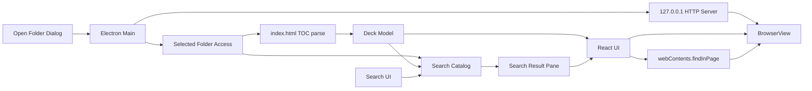

# HTML仕様書ビューワー開発計画

## 概要

任意ディレクトリ内の静的HTML仕様書をPPTのように閲覧・検索できるElectronデスクトップアプリを新規構築する。
まず仕様書とMVPスコープを明文化し、その仕様を満たす安全寄りのローカルビューワーとして実装する。

## 方針

- 新規アプリとして `package.json`、`src/`、`docs/` を作成する。
- 技術は `Electron + Vite + React + TypeScript` を前提にする。
- UIコンポーネントは shadcn/ui の Base UI 版を利用する。
- 仕様駆動開発として、先に `docs/product-spec.md` と `docs/mvp-requirements.md` を作り、MVPの挙動・非対象・受け入れ条件を定義する。
- MVPは静的HTML/CSS/画像中心とし、HTML内JavaScriptの高度な実行、外部API通信、任意コード実行は後続検討に分ける。

## アーキテクチャ

- React UI（ページ一覧、検索、ツールバー）と仕様書表示（`BrowserView`）を分離する。
- フォルダを開いたとき、Electron main で `127.0.0.1` のみにバインドするローカルHTTPサーバーを起動し、選択フォルダをドキュメントルートとして配信する。
- `BrowserView` は `http://127.0.0.1:PORT/...` を表示する。フォルダ変更またはアプリ終了時にサーバーを停止する。
- `../` などでルート外に出るパスは拒否する。サーバーは main プロセス内で動かす。
- Electronは `contextIsolation: true`、`nodeIntegration: false` を基本にし、rendererからのファイルアクセスはpreload経由の限定APIに閉じる。

## ページ定義と目次

- 入力単位は「1仕様書 = 1フォルダ」。Electronのディレクトリ選択ダイアログで任意フォルダを開く。
- ページ順は `manifest.json` では管理しない。`index.html` を目次として扱い、**目次に載っているリンクだけ**をページとする。
- サブフォルダ内の `.html` も対象とする（例: `chapters/01-intro.html`）。
- `index.html` 自体はページ一覧に含めない（目次専用）。
- フォルダを開いた直後は、目次の1ページ目を表示する。
- ページ一覧はサムネイルなし。番号・ページタイトル・ファイルパスを表示する。
- ページタイトルは目次リンクテキストを優先し、空なら各HTMLの `<title>` → 最初の見出し → ファイル名の順で推定する。

### アンカー付きリンク

- `page.html#section` はページ一覧では `page.html` と同一ページとして統合する（重複排除）。
- ページ行をトグル展開し、目次上の `#section` を子項目として選択できるようにする。
- 子項目を選んだときは `http://127.0.0.1:PORT/page.html#section` を開き、該当箇所へスクロールする。

### リンク種別の扱い

| 種別 | 扱い |
|------|------|
| フォルダ内 `.html` | 有効なページとして表示・閲覧 |
| 実ファイルが無いリンク | 一覧にグレーアウト表示。「見つかりません」と表示し選択不可 |
| フォルダ外 `.html` | 一覧にグレーアウト表示。「範囲外」と表示し選択不可 |
| `https://` 外部URL | 一覧に「外部リンク」として表示。選択時は `shell.openExternal()` で通常ブラウザを開く |

### 目次がない場合のフォールバック

- `index.html` が無い、または目次リンクが1件も無い場合は、選択フォルダ配下の `.html` を再帰スキャンして自然順でページ化する（`index.html` は除外）。
- このとき **「目次がありません」** の警告を表示する。

### HTML内リンクの遷移

- 表示中HTML内の同一仕様書内 `.html` リンクは捕捉し、ビューワー内で遷移する。左ペインの選択状態も同期する。
- `https://` 外部URLは通常ブラウザで開く。

## 検索

### 二段構え

1. **全ページ検索（カタログ）**: main が選択フォルダ配下のHTMLを読み、ページ別のヒット件数・抜粋をメモリ上に構築する。
2. **ページ内検索（表示）**: 該当ページを `BrowserView` で表示後、`webContents.findInPage()` でハイライト・スクロール・前後移動する。

### ページ内検索の標準挙動

- 独自DOM検索や `details.open = true` などの手動展開は実装しない。
- `details` や `hidden=until-found` など、ChromiumのFind in Pageが自動的に表示可能にする標準HTML構造は、ブラウザ標準挙動に任せる。
- CSSの `display: none` や独自JSアコーディオンで完全に隠した領域はMVPの検索表示保証外とする。

### 検索ナビゲーション

- 「次へ」「前へ」はドキュメント全体で連続する。現在ページ内の一致を辿り終えたら、次にヒットがあるページへ自動移動して続ける。
- 大文字小文字の区別は切替可能とし、デフォルトは区別しない。カタログ検索と `findInPage({ matchCase })` で同じ設定を使う。

### 検索UI

- 上部ツールバーに検索ボックスを置く。
- 検索時だけ右ペインを開き、ページ別のヒット一覧を表示する。
- 左のページ一覧へのヒット件数バッジ表示はMVPでは行わない（右ペインに集約）。

## UIと操作

### レイアウト

- 左ペイン: ページ一覧
- 中央: 仕様書表示（`BrowserView`）
- 上部: 検索・ページ移動・ズーム・表示切替
- 右ペイン: 検索結果（検索時のみ）

### ズーム

- ブラウザ標準ズーム（`webContents.setZoomFactor()` / `setZoomLevel()`）をUIから操作する。
- 拡大・縮小・100%リセットを提供する。「幅に合わせる」はMVPでは実装しない。

### 表示切替

- サイドバー（ページ一覧）の表示 / 非表示
- 集中モード（サイドバーと一部ツールバーを隠し、仕様書表示を広く見せる）

### キーボードショートカット

| 操作 | 割り当て |
|------|----------|
| 前 / 次のページ | `←` / `→` |
| 検索フォーカス | `Ctrl+F` |
| 次 / 前の検索ヒット | `Enter` / `Shift+Enter` |
| 拡大 / 縮小 | `Ctrl +` / `Ctrl -` |
| 100%に戻す | `Ctrl+0` |
| 集中モード解除 | `Esc` |

### 起動時

- 前回フォルダの自動オープンはしない。
- メニューから最近使ったフォルダを選べるようにする。

## 実装ステップ

- プロダクト仕様書とMVP要件を作成する。
- Electron + Vite + React + TypeScript の雛形を作り、ビルド・Lint・型検査の最低限を整える。
- shadcn/ui Base UI 版を導入し、アプリ全体のUIプリミティブとテーマ方針を定義する。
- Electron main/preload/renderer の責務とIPC APIを仕様書に定義する。
- ローカルHTTPサーバー、`BrowserView`、目次解析、デッキ生成を実装する。
- `DeckPage`、`DeckToc`、`SearchHit` などの型と、リンク種別判定・フォールバック処理を実装する。
- PPT風レイアウトを作る: ページ一覧（アンカートグル含む）、ビューワー、ツールバー、検索結果ペイン。
- 全ページ検索カタログ、`findInPage()` によるページ内検索、ドキュメント横断の次/前移動を実装する。
- ズーム、表示切替、キーボードショートカット、最近使ったフォルダ、HTML内リンク同期を実装する。
- サンプルデッキを `sample-decks/basic/` に置き、受け入れテスト観点を追加して動作確認する。

## 後続候補

- 左ペインへの検索ヒット件数バッジ表示
- 起動時の前回フォルダ自動復元
- 「幅に合わせる」ズーム
- コメント、レビュー状態、差分表示、発表者モード、PDF/PPTXエクスポート
- AI活用向けに、仕様書フォルダから構造化コンテキストを出力する `spec-index.json` やMarkdown要約を生成する仕組み
- 署名済みデスクトップ配布
