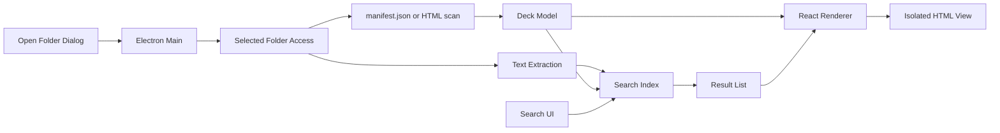

# HTML仕様書ビューワー開発計画

## 概要

空のワークスペースに、任意ディレクトリ内の静的HTML仕様書をPPTのように閲覧・検索できるElectronデスクトップアプリを新規構築する。
まず仕様書とMVPスコープを明文化し、その仕様を満たす安全寄りのローカルビューワーとして実装する。

## 方針

- 新規アプリとして `package.json`、`src/`、`docs/` を作成する。
- 技術は `Electron + Vite + React + TypeScript` を前提にする。デスクトップアプリとして任意のローカルディレクトリを開き、フォルダ内のHTML仕様書をPPT風に閲覧できるようにする。
- 仕様駆動開発として、先に `docs/product-spec.md` と `docs/mvp-requirements.md` を作り、MVPの挙動・非対象・受け入れ条件を定義する。
- MVPは静的HTML/CSS/画像中心とし、HTML内JavaScriptの高度な実行、外部API通信、任意コード実行は後続検討に分ける。

## MVP仕様

- 入力単位は「1仕様書 = 1フォルダ」。Electronのディレクトリ選択ダイアログで任意フォルダを開く。
- フォルダ内の `manifest.json` があればページ順・タイトル・HTMLファイルパスを採用する。ない場合は `index.html` と同階層のHTML一覧から暫定デッキを生成する。
- 各ページは隔離された表示領域でブラウザ表示し、ローカルファイル読み込みは選択フォルダ配下に制限する。
- 左ペインにページ一覧、中央に現在ページ、上部に検索・ページ移動・ズーム・表示切替を置く。
- 全ページ検索では、Electron main/preload側で選択フォルダ配下のHTMLを読み、テキスト抽出してインデックス化し、ヒット件数・ページ別結果・前後移動を提供する。
- 検索結果を選ぶと該当ページへ移動し、ページ内の一致箇所をハイライトして、次/前の一致へ順番に移動できるようにする。

## 主要な設計

- サンプル仕様書を `sample-decks/basic/` に置き、任意ディレクトリ読み込み・検索・表示の受け入れ基準にする。
- Electronは `contextIsolation: true`、`nodeIntegration: false` を基本にし、rendererからのファイルアクセスはpreload経由の限定APIに閉じる。
- HTML表示はMVPでは静的HTML中心とし、外部通信や選択フォルダ外の参照はブロックまたは未対応として仕様化する。
- 検索インデックスは初期実装ではクライアント内メモリで持つ。大量ページ対応や永続キャッシュは後続フェーズに分ける。

## 実装ステップ

- プロダクト仕様書とMVP要件を作成する。
- Electron + Vite + React + TypeScript の雛形を作り、ビルド・Lint・型検査の最低限を整える。
- Electron main/preload/renderer の責務とIPC APIを仕様書に定義する。
- `DeckManifest`、`DeckPage`、`SearchHit` などの型と読み込み処理を実装する。
- PPT風レイアウトを作る: ページ一覧、ビューア、ツールバー、検索結果ペイン。
- 全ページ検索とページ内ハイライト、次/前ヒット移動を実装する。
- サンプルデッキと受け入れテスト観点を追加し、仕様書に沿って動作確認する。

## 後続候補

- コメント、レビュー状態、差分表示、発表者モード、サムネイル生成、PDF/PPTXエクスポート。
- AI活用向けに、仕様書フォルダから構造化コンテキストを出力する `spec-index.json` やMarkdown要約を生成する仕組み。
- クライアント確認用に、署名済みデスクトップ配布、または閲覧専用Web版を別途整える。
